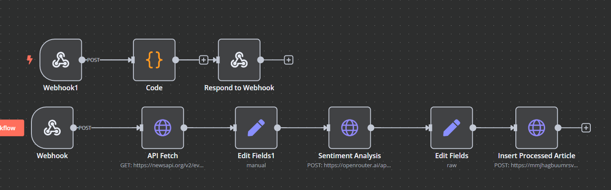

# 🚀 Nhost-Powered Hasura Project

## 📝 Overview
This project is built using **Nhost** as the backend service with **Hasura** for GraphQL-based database management. It fetches business news, performs sentiment analysis, and displays categorized news articles.

## Working with NHost

- Working with nhost can be quite difficult if you dont know it works and how it provides authentication , and how it owns it tables
- But once you get through it, It will be the best database to work with as it provides the best application for you web-app.
- So i recommend you to watch nhost tutorials as much as possible to learn it and use it.

## ✨ Features
- ✅ **News Fetching**: Retrieves top business news from a public API.
- ✅ **Sentiment Analysis**: Uses OpenRouter API + Hugging Face models.
- ✅ **Hasura Integration**: GraphQL-powered queries and mutations.
- ✅ **Nhost Authentication**: Secure user authentication.
- ✅ **Automated Processing**: Event triggers handle sentiment analysis.
- ✅ **Frontend Dashboard**: Displays categorized news articles.

## 🛠️ Tech Stack
### Backend
- **Nhost** (Database + Auth + Hasura)
- **Hasura** (GraphQL Engine)
- **PostgreSQL** (Database)
- **Node.js** (If using custom backend logic)

### Frontend
- **React.js** / **Next.js** (Framework)
- **Tailwind CSS** / **Material UI** (Styling)
- **Apollo Client** (GraphQL Data Fetching)

### APIs & Services
- **NewsAPI** (Fetching news data)
- **OpenRouter + Hugging Face** (Sentiment Analysis)
- **Nhost Storage** (For images/files, if needed)

## 📂 Folder Structure
```
project-root/
├── backend/         # Nhost backend with Hasura
├── frontend/        # React/Next.js frontend
├── scripts/         # Utility scripts (if any)
├── screenshots/     # Screenshots of the project
├── README.md       # Project documentation
```

## 📸 Screenshots
### Sign-in/Sign-up

- The First page we lands on is the Sign-in/Sign-up Page 


- After you choose Sign-up , you will get a email for authentication , if already signed-in then you will get the message {Already sign}


### Home Page/Dashboard

- You can see the news with AI sentiment Analysis done with Hugging Face free ai model


### Profile 

- You can view your profile with your basic details


### Load More

- It fetches news from API , so you can load news as possible with nhost table.
- Note: Nhost free tier dont allow to store high amount of data, you cannot directly store api data


### Preferences

- User can chose prefernces from the preference button , where you can redirect to your preference type of news with sentiments analysis


### N8N Workflow

- This n8n workflow helps you to understand how it fetches news , how hasura action and trigger works


### Hasura 
- I can give hasura screenshots , but it will not be helpful if you are learning hasura or graph ql as it will not help you to understand how you can work with graphQL

## 🚀 Setup Instructions
### 1️⃣ Clone the Repository
```sh
git clone https://github.com/amitkrsharma03/my-nhost-app
cd my-nhost-app
```

### 2️⃣ Install Dependencies
#### Backend Setup
Nhost provisions Hasura & PostgreSQL automatically—no manual setup needed.

#### Frontend Setup
```sh
cd frontend
npm install
```

### 3️⃣ Set Environment Variables
Create a `.env` file in the root directory and add the following:
```
NHOST_BACKEND_URL=your-nhost-backend-url
HASURA_GRAPHQL_URL=your-hasura-graphql-url
OPENROUTER_API_KEY=your-openrouter-api-key
NEWS_API_KEY=your-newsapi-key
```

### 4️⃣ Start the Development Server
```sh
npm run dev
```
🔹 The frontend will be available at `http://localhost:3000`

### 🚀 Deploying to Production
- **Backend**: Use Nhost's built-in deployment.
- **Frontend**: Deploy on Vercel / Netlify.

## 🔗 API Endpoints
### 📡 Fetch News
```graphql
query {
  news_raw {
    id
    title
    content
    sentiment
  }
}
```
### 📰 Insert News
```graphql
mutation InsertNews($news: [news_raw_insert_input!]!) {
  insert_news_raw(objects: $news) {
    returning {
      id
    }
  }
}
```

## Deployement

- Link : https://personalizednews.netlify.app/

## 🚀 Future Improvements
- Implement **real-time updates** using Hasura subscriptions.
- Enhance **UI/UX** with better animations and loading states.
- Optimize **AI model** for faster sentiment analysis.

## 🤝 Contributors
👤 **Amit Sharma** - Developer


